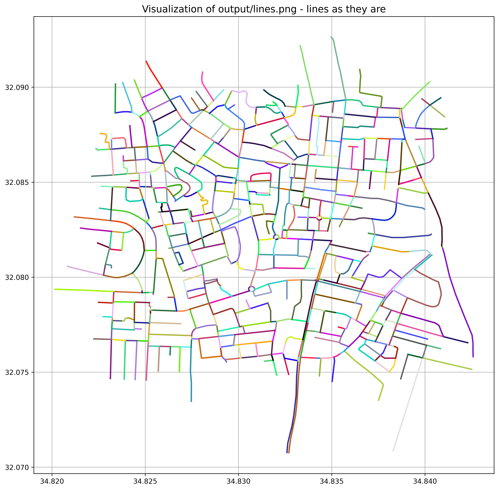
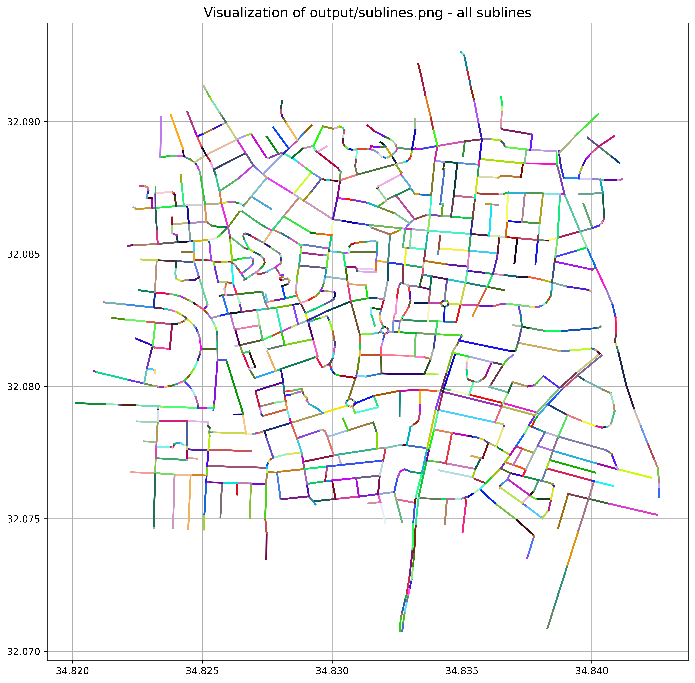

# Preparation Materials for Live Coding

Hey there!

Since we're looking for a Software Developer to work on a GIS project, we want to test candidates' adaptability in quickly learning and coding within a new domain.

We **don't** expect candidates to have prior knowledge of GIS—that's why we've prepared a sample code snippet demonstrating how to work with `.shp` files. In `main.py`, you'll find examples of how to render a `.shp` file to `.png`.

To feel confident during the interview, we recommend getting familiar with this repository:
- Run `main.py`
- Read through the code
- Experiment with it a little

Good luck, and have fun coding! 🚀

